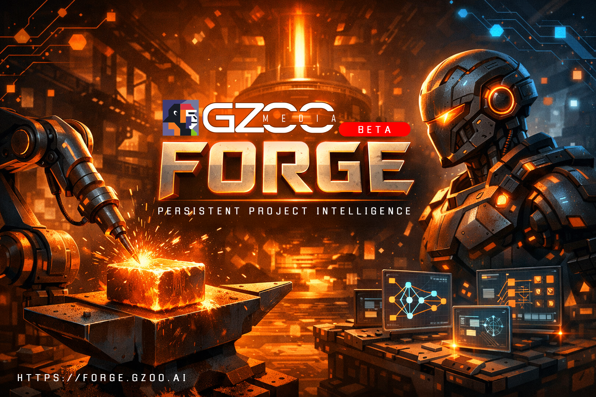

# GZOO Forge



Persistent project intelligence that converts conversation into structured decisions, constraints, and artifacts.

> conversation → structured meaning → decision → artifact → system change

A builder talks. The product thinks. The system evolves.

---

## How It Works

Every conversational turn flows through a pipeline:

1. **Classify** — Is this a decision, constraint, rejection, exploration, goal, correction, or noise?
2. **Extract** — Pull structured data: statement, rationale, category, certainty, alternatives
3. **Model** — Write to the project model (event-sourced, append-only)
4. **Propagate** — Check for constraint conflicts and tensions between decisions
5. **Surface** — Trust-calibrated notifications (flow state detection, interruption budgets)
6. **Execute** — Hook into external systems (GitHub issues, repo creation, spec commits)

The project model persists across sessions. When you come back tomorrow, Forge knows what was decided, what was rejected, and what's still open.

---

## Quick Start (Claude Code)

The primary integration. Add Forge as an MCP server and Claude Code automatically remembers everything.

Add to your Claude Code MCP config (`.mcp.json` in your project root):

```json
{
  "mcpServers": {
    "forge": {
      "command": "npx",
      "args": ["@gzoo/forge-mcp"],
      "env": {
        "ANTHROPIC_API_KEY": "sk-ant-..."
      }
    }
  }
}
```

Start Claude Code. That's it. See [packages/mcp/README.md](packages/mcp/README.md) for details.

---

## Quick Start (CLI)

For manual testing and inspection.

```bash
# Initialize a project
forge init "My SaaS App"

# Process conversational turns
forge turn "We're building an analytics dashboard for SMBs"
forge turn "Let's use TypeScript and Next.js"
forge turn "No PHP. Ever."
forge turn "I'm torn between Stripe and Paddle for payments"

# View the model
forge model     # Full project model
forge brief     # Session brief (what's decided, what's pending)
forge tensions  # Active constraint conflicts
forge trust     # Trust calibration metrics

# Cross-project memory
forge memory "database choice"

# Execution hooks (GitHub)
forge actions   # Propose actions based on decisions
forge execute <action-id>  # Approve and run
```

---

## Architecture

Monorepo with npm workspaces. 6 packages:

```
packages/
  core/       Types, IDs, provenance — zero dependencies
  store/      Event sourcing + SQLite (better-sqlite3)
  extract/    Two-stage LLM pipeline (classify → extract) + Cortex bridge
  execute/    Execution hooks (GitHub integration)
  cli/        CLI test surface (forge command)
  mcp/        MCP server for Claude Code integration
```

**Dependency flow:**

```
core ← store ← extract ← execute
                  ↑          ↑
                 cli        mcp
```

---

## Configuration

Copy `.env.example` to `.env` and set your provider:

| Variable | Description | Default |
|----------|-------------|---------|
| `FORGE_LLM_PROVIDER` | `anthropic`, `openai`, or `openai-compatible` | `anthropic` |
| `ANTHROPIC_API_KEY` | Anthropic API key | — |
| `OPENAI_API_KEY` | OpenAI (or compatible) API key | — |
| `OPENAI_BASE_URL` | Base URL for OpenAI-compatible providers | — |
| `FORGE_FAST_MODEL` | Override the fast/classifier model | Provider default |
| `FORGE_QUALITY_MODEL` | Override the quality/extractor model | Provider default |
| `GITHUB_TOKEN` | GitHub PAT for execution hooks | — |
| `GITHUB_OWNER` | GitHub username for execution hooks | — |

**Supported providers:** Anthropic (Claude), OpenAI, Groq, Together, Ollama, or any OpenAI-compatible API.

---

## CLI Reference

| Command | Description |
|---------|-------------|
| `forge init "name"` | Initialize a new project |
| `forge turn "text"` | Process a conversational turn |
| `forge model` | Display the full project model |
| `forge events` | Show the event log |
| `forge brief` | Generate a session brief |
| `forge artifacts` | Show generated spec artifacts |
| `forge tensions` | Show constraint tensions (active/resolved) |
| `forge actions` | Propose execution actions from decisions |
| `forge execute <id>` | Approve and execute an action |
| `forge trust` | Show trust calibration metrics |
| `forge workspace` | Show workspace values and risk profile |
| `forge memory "query"` | Search cross-project memory |

---

## Project Model

Forge builds a structured model from conversation with 5 layers:

**Intent** — Primary goal, success criteria, scope (in/out), quality bar, anti-goals.

**Decisions** — Statements with commitment levels:
- `exploring` — Mentioned, not committed
- `leaning` — Showing preference (auto-promoted from exploring)
- `decided` — Explicitly committed (**never automatic**)
- `locked` — Structural dependency, costly to reverse

**Constraints** — Hard or soft boundaries: technical, financial, timeline, ethical, etc.

**Rejections** — What was explicitly rejected, with type (categorical/conditional/deferred) and revealed preferences.

**Explorations** — Open questions and investigations with status tracking.

Cross-cutting: **Tensions** (conflicts between decisions/constraints) and **Artifacts** (generated specs from committed decisions).

### Cardinal Rule

> `leaning → decided` is **never** automatic. No exceptions.

A decision moves from leaning to decided only through explicit user commitment. Tests enforce this invariant.

---

## Phase Status

| Phase | Description | Status |
|-------|-------------|--------|
| 1 | Core model, event sourcing, extraction pipeline | Complete |
| 2 | Artifact generation engine | Complete |
| 3 | Constraint propagation + semantic conflict detection | Complete |
| 4 | Execution hooks (GitHub integration) | Complete |
| 5 | Trust calibration engine | Complete |
| 6 | Cross-project memory + workspace intelligence | Complete |
| MCP | MCP server for Claude Code | Complete |
| Cortex | Cortex Bridge for codebase-aware decisions | Complete |

**Test count:** 170 tests across 14 test files.

---

## Development

```bash
# Install dependencies
npm install

# Build all packages
npx tsc -b

# Run all tests
npx vitest run

# Run tests for a specific package
npx vitest run packages/extract

# Build and run the MCP server
npx tsc -b packages/mcp
node packages/mcp/dist/index.js
```

**Stack:** TypeScript (strict), SQLite via better-sqlite3, nanoid@3 (CJS-compatible).

---

## Requirements

| Dependency | Minimum Version | Notes |
|------------|----------------|-------|
| Node.js | 20+ | Required for all packages |
| npm | 9+ | Workspace support required |
| Claude Code | Latest | For MCP integration |
| LLM API key | — | Anthropic, OpenAI, or any OpenAI-compatible provider |
| Cortex | Latest | Optional — enables codebase-aware decisions |

The MCP server requires **one** LLM API key to process conversational turns. Without an API key, resources (like `forge://brief`) still work but `forge_process_turn` will fail.

---

## Your Project's .gitignore

When you install Forge in your project, add this to your `.gitignore`:

```gitignore
# Forge local state (decisions are stored locally, not in version control)
.forge/
```

The `.forge/` directory contains `state.json` (session tracking) and `forge.db` (SQLite database with all decisions). This is local per-developer state — it should not be committed.

---

## FAQ

**Do I need to pay for an API key?**
Yes. Forge uses LLM calls to classify and extract decisions from conversation. Each `forge_process_turn` call makes 1-2 API calls (classifier + extractor). Costs are minimal — a typical session uses a few cents of API credits.

**Can I use a local model (free)?**
Yes. Set `FORGE_LLM_PROVIDER=openai-compatible` and point `OPENAI_BASE_URL` at your local server (e.g., Ollama at `http://localhost:11434/v1`). Quality depends on the model — larger models extract decisions more reliably.

**Does Forge send my code to an API?**
No. Forge only sends conversational text (what you say) to the LLM for classification and extraction. Your source code, files, and project contents are never sent. All extracted decisions are stored locally in `.forge/forge.db`.

**Can I use this with Cursor, Windsurf, or other IDEs?**
Forge uses the MCP (Model Context Protocol) standard. Any IDE or tool that supports MCP stdio servers can use Forge. Claude Code has the most mature MCP support. Check your IDE's documentation for MCP server configuration.

**How do I reset and start fresh?**
Delete the `.forge/` directory in your project root. Next time Claude Code starts, Forge will prompt for a new `forge_init`.

**Where are my decisions stored?**
In `.forge/forge.db` (SQLite) in your project directory. The database is event-sourced — decisions are append-only events. You can inspect it with any SQLite viewer.

**Can multiple developers share decisions?**
Not yet. The `.forge/` directory is local state. Cross-developer synchronization is a potential future feature. For now, each developer has their own decision history.

---

## Cortex Integration

Forge integrates with [GZOO Cortex](https://github.com/gzoonet/cortex) to enrich decisions with codebase context. The two tools are complementary:

- **Forge** knows *why* — decisions, constraints, intent, rejections
- **Cortex** knows *what* — code entities, patterns, dependencies, architecture

When both are installed, Forge automatically queries Cortex's knowledge graph during decision extraction. If a developer says "Let's switch to PostgreSQL," Forge checks Cortex for existing database references, related services, and migration patterns — giving decisions real codebase awareness.

### How it works

1. On startup, Forge checks if `cortex` CLI is available
2. If found, it spawns `cortex mcp start` and connects via MCP (stdio JSON-RPC)
3. When new decisions or explorations are extracted, Forge queries Cortex in parallel with its own cross-project memory
4. Cortex matches appear in the extraction output alongside decisions

### Setup

Install both tools as MCP servers in your project:

```json
{
  "mcpServers": {
    "forge": {
      "command": "npx",
      "args": ["@gzoo/forge-mcp"],
      "env": { "ANTHROPIC_API_KEY": "sk-ant-..." }
    },
    "cortex": {
      "command": "npx",
      "args": ["@gzoo/cortex-mcp"]
    }
  }
}
```

Each tool works independently. Cortex works without Forge, Forge works without Cortex. When both are present, Forge queries Cortex automatically — no additional configuration needed.

---

## License

MIT
